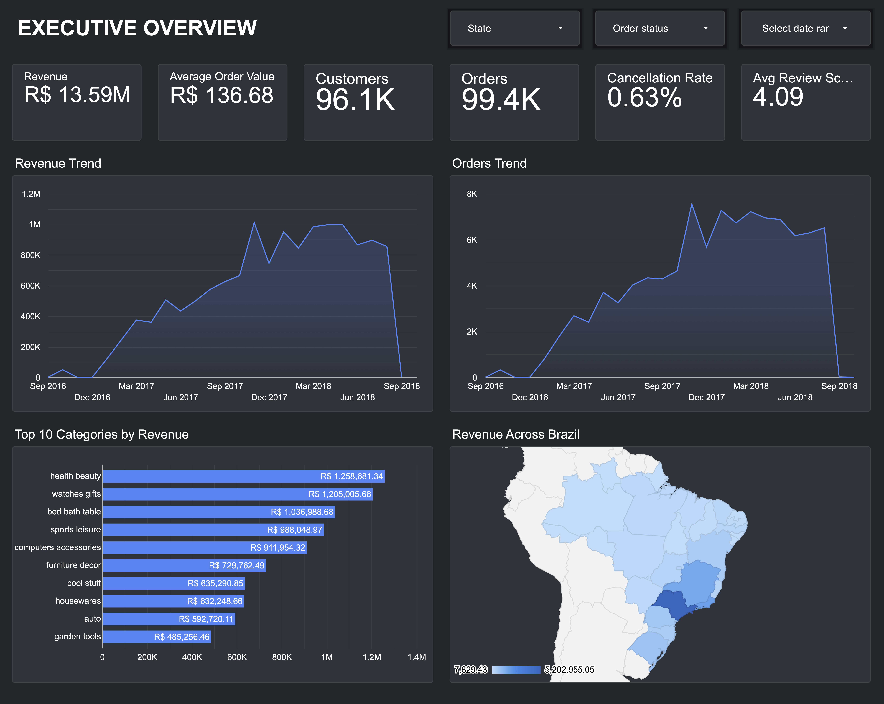
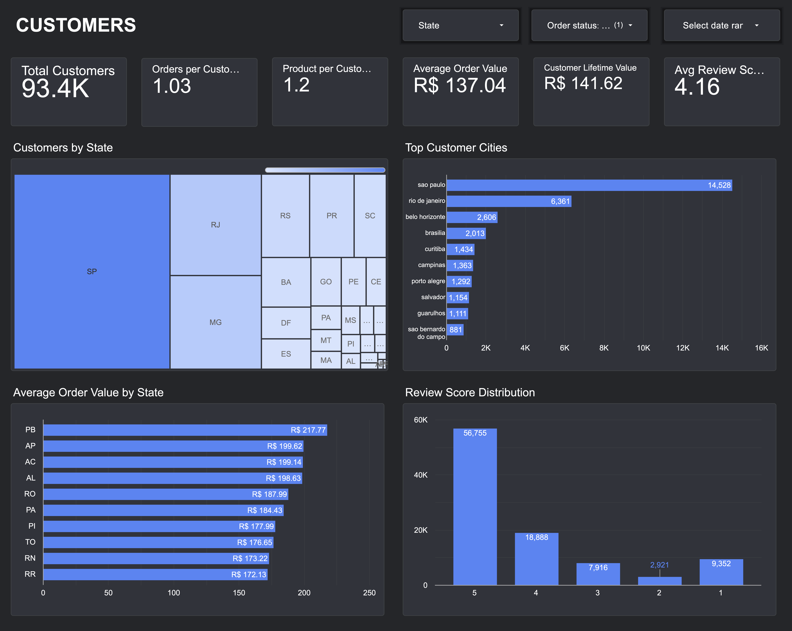
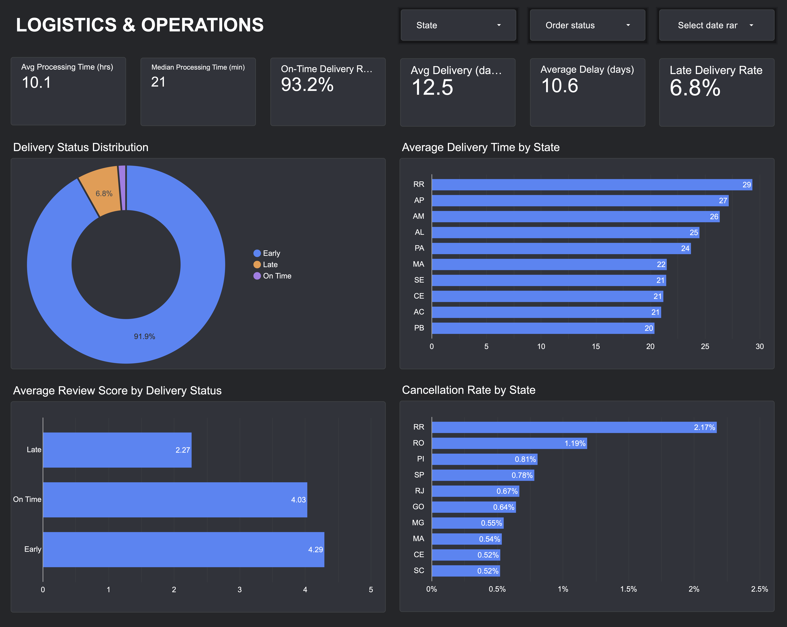

# Olist E-Commerce Analytics Project

This project based on the [Olist Brazilian E-Commerce dataset](https://www.kaggle.com/datasets/olistbr/brazilian-ecommerce/data), combining Python exploratory analysis, SQL data preparation in BigQuery and an interactive Looker dashboard.

## 🔗 Live Dashboard

[Looker Dashboard](https://datastudio.google.com/reporting/fea4deed-2664-4b2f-8e20-2711920695e0)

### 📊 Dashboard Preview








## 📓 Google Colab Notebooks

The exploratory analysis was conducted in Google Colab. Each notebook focuses on a different area of the business:

- [Business Performance Overview](https://colab.research.google.com/drive/15BnPVJxZOvt4YtGJfj474cs5GF_Yd1L-?usp=sharing)
- [Product Performance](https://colab.research.google.com/drive/1t2IJivd7T6hFLRJaHhxXV1TrRpWHKi3Y?usp=sharing)
- [Customer & Purchase Behavior](https://colab.research.google.com/drive/10oTuPSsm2i9L6Fb-TcSsjUVuPwI2N3Nm?usp=sharing)
- [Operations & Logistics](https://colab.research.google.com/drive/1VUZ2wI_6JRYGvPn7sf8Ju1u-T2ACAx6i?usp=sharing)

---

## 📌 Project Goals

The goal of this project is to analyze an e-commerce marketplace from four business perspectives:

- Overall business performance
- Sales and product performance
- Customer purchase behavior
- Operations and logistics

The analysis answers questions around revenue, orders, customers, product categories, customer behavior, delivery performance, delays, cancellations and customer satisfaction.

---

## 🗂️ Repository Structure

```text
olist-ecommerce-analysis/
│
├── notebooks/
│   ├── business_performance_overview.ipynb
│   ├── product_performance.ipynb
│   ├── customer_purchase_behavior.ipynb
│   └── operations_logistics.ipynb
│
├── sql/
│   └── looker_dashboard.sql
│
├── screenshots/
│   ├── executive_overview.png
│   ├── sales_products.png
│   ├── customers.png
│   └── logistics_operations.png
│
├── README.md
└── .gitignore
```
---

## 🧱 Data Architecture

```text
Olist Raw Tables
       │
       ▼
Python / BigQuery Analysis
       │
       ▼
SQL Data Preparation
       │
       ├── dashboard_orders
       │      1 row = 1 order
       │
       ├── dashboard_order_items
       │      1 row = 1 order item
       │
       ▼
Looker (Interactive Dashboard)
```
Separating order-level and item-level data prevents order-level metrics from being duplicated when an order contains multiple items.

---

## 🛠️ Tech stack
- **BigQuery** - data warehouse, source tables + SQL transformations
- **Python** - exploratory analysis in Google Colab
- **Looker** - dashboard and data visualization

---

## 📊 Dashboard pages


| Page | Metrics |
| :--- | :--- |
| Executive Overview | Revenue, Average Order Value, Customers, Orders, Cancellation Rate, Average Review Score, Revenue Trend, Orders Trend, Top Categories, Revenue by State |
| Sales & Products | Product Sold, Revenue, Average Product Price, Average Freight Cost, Unique Products, Product Categories, Top Categories by Revenue, Top Categories by Units Sold, Product Category Performance, Average Price by Category, ABC Analysis |
| Customers | Total Customers, Orders per Customer, Products per Customer, Average Order Value, Customer Lifetime Value, Average Review Score, Customers by State, Top Customers Cities, Average Order Value by State, Review Score Distribution |
| Logistics & Operations | Average Processing Time, Median Processing Time, On-Time Delivery Rate, Average Delivery, Average Delay, Late Delivery Rate, Delivery Status Distribution, Delivery Time by State, Review Score by Delivery Status, Cancellation Rate by State |

---

## 🔍 Key insights
- Revenue is concentrated across a relatively small group of product categories, with the ABC analysis identifying the categories responsible for the largest share of total revenue.

- Delivery performance has a strong relationship with customer satisfaction: average review scores are substantially lower for late deliveries than for early deliveries.

- Most orders are delivered earlier than the estimated delivery date, while a smaller share of orders are delivered late.

- Customer and revenue performance vary significantly across Brazilian states, highlighting geographic differences in marketplace activity
